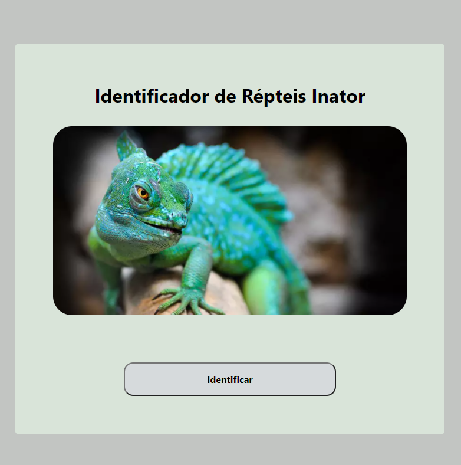

# Projeto IF668

    
    
    

---

Se utiliza do serviço do Machine Learning for Kids para reconhecimento de imagens de forma a identificar a ordem dos répteis.

## Possíveis resultados
 - Chelonia
 - Crocodylia
 - Squamata
 - Rhynchocephalia
 - Outro

## Forma de treinamento
Foi utilizado 3 máquinas para se realizar a identificação, no qual: 
    
    A primeira máquina identifica se é um réptil ou não com 50 imagens de cada opção.

    A segunda máquina identifica se esse réptil é um dos 3 tipos (chelonia, crocodylia ou squamata), com uma média de 33 imagens cada.

    Por fim, se for squamata, verifica se não é um Rhynchocephalia com 50 imagens cada.

## Tecnologias
- [Machine Learning For Kids](https://machinelearningforkids.co.uk/)
- [Eel](https://github.com/samuelhwilliams/Eel)
- [Python](https://www.python.org/)
- HTML/CSS/JS

A parte de machine learning é disponibilizada pela IBM através do machine learning for kids. O frontend foi feito através de HTML/CSS/Javascript puro, no qual é inicializado através de um servidor python se utilizando da biblioteca *Eel* para disponibilizar a possibilidade de usar funções python para as requisições.

> Foi se utilizado várias formas para se realizar as requisições unicamente através do browser utilizando Javascript, mas tudo foi bloqueado pelo CORS.